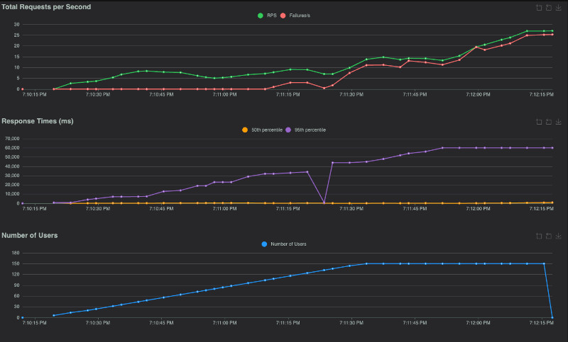

# Labo 04 – Optimisation, Caching, Load Balancing, Test de charge, Observabilité

    
ÉTS - LOG430 - Architecture logicielle - Chargé de laboratoire: Gabriel C. Ullmann.

## 🎯 Objectifs d'apprentissage
- Apprendre à configurer [Prometheus](https://prometheus.io/docs/introduction/overview/)
- Apprendre à effectuer des tests de charge avec [Locust](https://docs.locust.io/en/stable/what-is-locust.html)
- Comprendre les types d'optimisation possibles dans le contexte du Store Manager ainsi que les avantages et inconvénients de chacun
- Apprendre à implémenter le cache en mémoire avec Redis et l'équilibrage de charge (load balancing) avec [Nginx](https://nginx.org/en/docs/http/load_balancing.html)

## ⚙️ Setup

Dans ce laboratoire, on continuera à utiliser la même version du Store Manager développée au laboratoire 03, mais nous ferons quelques petites modifications. Le but n'est pas d'ajouter de nouvelles fonctionnalités, mais de mesurer et comparer la performance de lecture/écriture de l'application en utilisant MySQL et Redis. Après avoir mesuré et comparé, nous allons implémenter 3 approches d'optimisation : éliminer le problème N+1, implémenter le caching et le load balancing.

En résumé, dans ce laboratoire, nous nous concentrerons non seulement sur la surveillance (mesure des variables et observation passive), mais aussi sur l'observabilité (agir sur nos observations pour modifier le logiciel ou son environnement).

> ⚠️ **IMPORTANT** : Les documents ARC42 et ADR contenus dans ce dépôt sont identiques à ceux du laboratoire 03, car nous ne modifions pas l'architecture de l'application dans ce laboratoire.

> 📝 **NOTE** : À partir de ce laboratoire, nous vous encourageons à utiliser la bibliothèque `logger` plutôt que la commande `print`. Bien que `print` fonctionne bien pour le débogage, l'utilisation d'un logger est une bonne pratique de développement logiciel car elle offre [plusieurs avantages lorsque notre application entre en production](https://www.geeksforgeeks.org/python/difference-between-logging-and-print-in-python/). Vous trouverez un exemple d'utilisation du `logger` et plus de détails dans `src/stocks/commands/write_stock.py`.

### 1. Créez un nouveau dépôt à partir du gabarit et clonez le dépôt
```bash
git clone https://github.com/[votredepot]/log430-labo4
cd log430-labo4
```

### 2. Créez un réseau Docker
Exécutez dans votre terminal :
```bash
docker network create labo04-network
```

### 3. Générez des données fictives (mock data)
Pendant ce laboratoire, nous réaliserons des **tests de charge** pour évaluer les limitations de performance de l'application sous une forte pression. Pour simuler un environnement de production réaliste, nous utiliserons un volume important de données générées par le script `generators/data_generator.py`. Exécutez ce script sur votre ordinateur **avant de démarrer le conteneur Docker**. Il générera automatiquement des commandes INSERT (MySQL) et SET (Redis) pour :

- 1000 utilisateurs
- 10 000 articles (avec quantités de stock aléatoires)
- 80 000 commandes (contenant 1-5 articles chacune, en utilisant des `product_ids` et `user_ids` aléatoires)

> 📝 **NOTE** : Ces chiffres correspondent aux données que 2 magasins pourraient accumuler en 1 an d'utilisation continue (≈110 commandes/jour), ou 3 magasins pendant 1 an (≈75 commandes/jour).

Les commandes MySQL et Redis générées seront exécutées automatiquement au démarrage des conteneurs Docker (étape 4). Aucune action supplémentaire n'est requise, mais l'initialisation peut prendre quelques secondes. Vous pouvez surveiller la progression en consultant les logs Docker de vos serveurs MySQL ou Redis.

### 4. Préparez l'environnement de développement
Suivez les mêmes étapes que dans le laboratoire dernier (ex. création d'un fichier `.env`, etc.).

### 5. Installez Postman
Suivez les mêmes étapes que dans le laboratoire dernier. Importez la collection disponible dans `/docs/collections`.

## 🧪 Activités pratiques
Pendant le labo 02, nous avons implémenté le cache avec Redis. Pendant le labo 03, nous avons utilisé ce cache pour les endpoints des rapports. Dans ce labo, nous allons temporairement désactiver Redis pour mesurer la différence entre les lectures à MySQL vs Redis. Pour faciliter les comparaisons, dans ce laboratoire les méthodes qui font la génération de rapports dans `queries/read_order.py` ont 2 versions : une pour MySQL, une autre pour Redis.

### 1. Désactivez le cache Redis temporairement
Dans `queries/read_order.py`, remplacez l'appel à `get_highest_spending_users_redis` par `get_highest_spending_users_mysql`. Également, remplacez l'appel à `get_best_selling_products_redis` par `get_best_selling_products_mysql`. Ça sera important à partir de l'activité 5.

### 2. Instrumentez Flask avec Prometheus
Avant le test de charge proprement dit, préparons notre code pour l'observabilité. Dans `store_manager.py`, ajoutez un endpoint `/metrics`, qui permettra à Prometheus de lire l'état des variables que nous voulons observer dans l'application.
```python
@app.route("/metrics")
def metrics():
    return generate_latest(), 200, {"Content-Type": CONTENT_TYPE_LATEST}
```

N'oubliez pas d'ajouter également les `imports` suivants :
```python
from prometheus_client import Counter, generate_latest, CONTENT_TYPE_LATEST
```

### 3. Créez des Counters 
Également dans `store_manager.py`, ajoutez les objets [Counter](https://prometheus.io/docs/concepts/metric_types/#counter) pour compter le nombre de requêtes aux endpoints `/orders`, `/orders/reports/highest-spenders` et `/orders/reports/best-sellers`. N'oubliez pas d'appeler la méthode `inc()` pour incrémenter la valeur du compteur à chaque requête. Par exemple :

```python
counter_orders = Counter('orders', 'Total calls to /orders')
@app.post('/orders')
def post_orders():
    counter_orders.inc()
```

Redémarrez les conteneurs Docker.
```bash
docker compose restart store_manager
docker compose restart prometheus              
```

### 4. Observez les métriques dans Prometheus
Dans Postman, faites quelques requêtes à `POST /orders`. Ensuite, accédez à Prometheus sur `http://localhost:9090` et exécutez une requête (query) à `orders_total`. Vous devriez voir une valeur numérique associée à la variable. Faites la même chose pour les deux autres `Counters`. Par exemple, si vous avez nommé le compteur `highest_spenders`, exécutez une requête à `highest_spenders_total`. Cliquez sur `Graph` pour voir la représentation visuelle de chaque variable. Faites quelques requêtes de plus pour voir le changement des variables.

> 📝 **NOTE 1** : Prometheus ne met pas automatiquement à jour les variables dans l'interface Web lorsqu'elles changent sur le serveur. Vous devez cliquer sur `Query` ou recharger la page Web pour voir les valeurs mises à jour.

> 📝 **NOTE 2** : N'oubliez pas que la surveillance et l'observabilité ne concernent pas uniquement les développeurs. Dans un environnement professionnel, vous pouvez utiliser des outils tels que [Grafana](https://grafana.com/docs/grafana/latest/setup-grafana/installation/docker/) pour créer des graphiques plus intuitifs et faciles à utiliser qui peuvent être utilisés pour les autres membres de votre équipe pour rester informés sur l'état de l'application et pour prendre des décisions. 

### 5. Lancez un test de charge avec Locust
Nos tests de charge seront effectués à l'aide de Locust, un outil web qui exécute les tests définis par nous dans `locustfiles`. Le script `locustfiles/locustfile.py` lorsqu'il est exécuté, effectuera plusieurs appels vers des endpoints (représentés par les méthodes `@task`), simulant des utilisateurs réels. Il appelera :
- L'endpoint `POST /orders` pour tester l'écriture. Le script créera des commandes en utilisant des articles, des quantités et des utilisateurs aléatoires.
- Les endpoints `GET /orders/reports/highest-spenders` et `GET /orders/reports/best-sellers` pour tester la lecture. 

Dans ce labo, nous ne modifierons pas le `locustfile`, nous l'activerons simplement à partir de l'interface web de Locust. Si vous êtes curieux d'en savoir plus sur comment écrire des scripts de test de charge plus complexes, vous pouvez trouver plus d'informations sur la [documentation officielle de Locust](https://docs.locust.io/en/stable/writing-a-locustfile.html).

Pour exécuter le test, accédez à `http://localhost:8089` et appliquez les paramètres suivants :
- **Number of users (nombre total d'utilisateurs)** : 150
- **Spawn rate (taux d'apparition des nouveaux utilisateurs)** : 2 (par seconde)
- **Host** : Il est préférable d'exécuter les tests de charge sur un serveur externe (par exemple, une VM LXD). Ouvrez le port 5000 dans la VM et d'autres ports si nécessaire. Si vous n'avez pas accès à une VM, vous pouvez installer [votre propre instance LXD](https://canonical.com/lxd/install) sur une VM Linux dans votre ordinateur à l'aide d'Oracle VirtualBox ou d'un autre logiciel similaire. Alternativement, si cette option ne fonctionne pas non plus pour vous, vous pouvez exécuter les tests de charge directement dans votre ordinateur, sans utiliser une VM.
- **Cliquez sur l'onglet Advanced Options > Run time (temps d'exécution)** : 120s (ou 2m)

> 📝 **NOTE** : Les indicateurs mesurés par Locust correspondent aux [4 métriques d'or](https://sre.google/sre-book/monitoring-distributed-systems/#xref_monitoring_golden-signals) définies par Google.

Lancez le test et observez les statistiques (onglet `Statistics`) et graphiques (onglet `Charts`) dans Locust. Au cours de ce test, vous allez observer que le nombre d'utilisateurs, les requêtes et le temps de réponse augmentent progressivement. À un certain point, le nombre d'échecs (ligne rouge) devra commencer à augmenter rapidement et ne jamais diminuer, indiquant que le Store Manager a atteint sa limite de capacité de fonctionnement normal (capture d'écran ci-dessous). Le moment précis de la panne peut varier en fonction des ressources de calcul disponibles sur votre machine virtuelle ou votre ordinateur.



> 💡 **Question 1** : Combien d'utilisateurs faut-il pour que le Store Manager commence à échouer dans votre environnement de test ? Pour répondre à cette question, comparez la ligne `Failures` et la ligne `Users` dans les graphiques.

> 💡 **Question 2** : Sur l'onglet `Statistics`, comparez la différence entre les requêtes et les échecs pour tous les endpoints. Combien d'entre eux échouent plus de 50 % du temps ?

> 💡 **Question 3** : Affichez quelques exemples des messages d'erreur affichés dans l'onglet `Failures`. Ces messages indiquent une défaillance dans quelle(s) partie(s) du Store Manager ? Par exemple, est-ce que le problème vient du service Python / MySQL / Redis / autre ?

Enregistrez le contenu du tableau `Statistics`, nous l'utiliserons plus tard pour comparer les tests suivants (par exemple, vous pouvez copier-coller le tableau dans Excel/Google Sheets ou dans un fichier texte).

### 6. Optimisez la lecture des données des articles
Nous avons vérifié que la performance du Store Manager ne répond pas à nos exigences (prise en charge de 150 utilisateurs simultanés). Avant d'envisager un changement d'architecture, de base de données, de serveur Web ou une augmentation des ressources (RAM/CPU) sur notre serveur on-premises ou en nuage, il est raisonnable de vérifier si une optimisation du code existant est possible. Cette approche présente généralement le meilleur rapport coût-efficacité.

Dans `orders/commands/write_order.py`, si nous regardons attentivement la fonction `add_order`, nous verrons qu'elle ne récupère pas les informations des articles de manière efficace. Si nous avions, par exemple, 100 articles dans notre commande, la fonction effectuerait 100 requêtes à la base de données pour chercher les informations sur les articles ([problème N+1](https://planetscale.com/blog/what-is-n-1-query-problem-and-how-to-solve-it)).

```python
# ❌ Code non-optimisé
product_prices = {}
for product_id in product_ids:
    product = session.query(Product).filter(Product.id == product_id).all()
    product_prices[product_id] = product[0].price
```

Pour résoudre ce problème, modifiez la méthode `add_order` de façon à collecter et récupérer tous les `product_ids` en une seule requête. Nous utiliserons toujours une boucle `for`, mais la requête de base de données **ne se trouvera pas dans la boucle**.
```python
# ✅ Code optimisé (implémentation partielle)
product_prices = {}
product_ids = [1, 2, 3] # TODO: Collectez le product_id de chaque OrderItem dans la commande
products = session.query(Product).filter(Product.id.in_(product_ids)).all()
for product in products:
    product_prices[product.id] = product.price
```

Redémarrez votre conteneur `store_manager` pour vous assurer qu'aucun processus issu du test de charge précédent n'est en cours d'exécution. 
```bash
docker compose restart store_manager                  
```

Ensuite, **relancez les tests Locust** avec les mêmes paramètres que ceux de la dernière activité. Observez et répondez aux questions.

> 💡 **Question 4** : Sur l'onglet `Statistics`, comparez les résultats actuels avec les résultats du test de charge précédent. Est-ce que vous voyez quelques différences dans les métriques pour l'endpoint `POST /orders` ?

> 💡 **Question 5** : Si nous avions plus d'articles dans notre base de données (par exemple, 1 million), ou simplement plus d'articles par commande en moyenne, le temps de réponse de l'endpoint `POST /orders` augmenterait-il, diminuerait-il ou resterait-il identique ?

Enregistrez le contenu du tableau `Statistics`, nous l'utiliserons plus tard pour comparer les tests suivants (par exemple, vous pouvez copier-coller le tableau dans Excel/Google Sheets ou dans un fichier texte).

> 📝 **NOTE** : Bien que cela ne s'applique pas à ce laboratoire, les applications complexes peuvent améliorer leurs performances de lecture en implémentant plusieurs stratégies : la [création d'index](https://www.w3schools.com/mysql/mysql_create_index.asp), la [normalisation des données](https://www.ibm.com/fr-fr/think/topics/database-normalization), ou l'augmentation du [nombre de connexions MySQL](https://dev.mysql.com/doc/refman/8.4/en/server-system-variables.html#sysvar_max_connections). Cependant, ces solutions ne constituent que des mesures temporaires si le véritable enjeu réside dans la gestion d'un grand nombre de requêtes simultanées. Ce sujet est détaillé dans la dernière section de ce document.

### 7. Réactivez Redis et optimisez la génération des rapports

Étant donné que nous avons fait tout notre possible dans le code pour améliorer la vitesse d'écriture, nous allons maintenant tenter d'améliorer la vitesse de lecture en utilisant le cache.Dans `queries/read_order.py`, remplacez l'appel à `get_highest_spending_users_mysql` par `get_highest_spending_users_redis`. Également, remplacez l'appel à `get_best_selling_products_mysql` par `get_best_selling_products_redis`.

Redémarrez votre conteneur `store_manager` pour vous assurer qu'aucun processus issu du test de charge précédent n'est en cours d'exécution. Ensuite, **relancez les tests Locust** avec les mêmes paramètres que ceux de la dernière activité. Observez et enregistrez le contenu du tableau `Statistics`, nous l'utiliserons plus tard pour comparer les tests suivants (par exemple, vous pouvez copier-coller le tableau dans Excel/Google Sheets ou dans un fichier texte).

Contrairement à ce que l'on pourrait croire, vous constaterez une augmentation générale du temps de réponse et une diminution du nombre de requêtes traitées. Mais pourquoi ? Même si Redis est en mémoire et que l'accès à la mémoire est rapide, nous l'interrogeons très fréquemment pour obtenir la liste de commandes (`r.keys("order:*")`), puis nous parcourons cette liste, récupérons l'objet commande (`r.hgetall(key)`) et le traitons pour générer le rapport. Cette approche prend trop de temps, et la durée nécessaire augmente proportionnellement à la quantité de commandes et d'articles par commande. Pour résoudre ce problème, nous devons conserver le rapport en cache pendant une période déterminée. Le rapport ne sera désormais plus mis à jour en temps réel, mais cette solution nous permettra de servir des rapports très récents de manière quasi instantanée.

Veuillez copier et coller le code optimisé fourni dans le répertoire `/optimization`. Vous devez mettre à jour l'implémentation de `src/orders/queries/read_order.py` et ajouter l'extrait de code fourni au fichier `src/store_manager.py` après la déclaration de la variable `app`. N'oubliez pas de mettre à jour les appels aux rapports dans `src/orders/controllers/order_controller.py` en ajoutant le paramètre `skip_cache` dans les 2 fonctions :

```py
def get_report_highest_spending_users(skip_cache=False):
    """Get orders report: highest spending users"""
    return get_highest_spending_users(skip_cache)

def get_report_best_selling_products(skip_cache=False):
    """Get orders report: best selling products"""
    return get_best_selling_products(skip_cache)
```

Le code optimisé fera ce qui suit :
1. Générer les 2 rapports et les enregistrer dans Redis dès que le Store Manager démarre. Dans ce cas, il ignorera simplement tout cache existant (`skip_cache=True`).
2. Les méthodes de génération de rapports ne liront que le rapport entièrement rendu déjà mis en cache dans Redis (`skip_cache=False`), sans essayer de le régénérer à chaque fois ni de le régénérer depuis MySQL.
3. Les rapports seront régénérés toutes les 60 secondes afin d'afficher les dernières modifications. Peu importe le temps que prendra la génération, l'ancien rapport sera livré aux utilisateurs jusqu'à ce que le nouveau soit disponible. Ainsi, le cache ne sera jamais vide et cela permet d'éviter un problème de [cache stampede](https://www.geeksforgeeks.org/system-design/cache-stempede-or-dogpile-problem-in-system-design/).

> 📝 **NOTE** : Techniquement, régénérer les rapports toutes les 60 secondes est un gaspillage de ressources, car nous les régénérerons même si personne ne les utilise ou même lorsqu'il n'y a pas de changement. Cependant, il s'agit d'une optimisation simplifiée à des fins didactiques pour ce laboratoire. Si vous souhaitez en savoir plus sur les solutions robustes et élégantes aux problèmes de « cache stampede » et « thundering herds », veuillez lire cet article : [Thundering Herds: The Scalability Killer](https://docs.aonnis.com/blog/thundering-herds-the-scalability-killer).

Redémarrez tous vos conteneurs (`docker compose restart`) pour vous assurer qu'aucun processus issu du test de charge précédent n'est en cours d'exécution. Ensuite, **relancez les tests Locust** avec les mêmes paramètres que ceux de la dernière activité.

> 💡 **Question 6** : Sur l'onglet `Statistics`, comparez les résultats actuels avec les résultats du test de charge précédent. Est-ce que vous voyez quelques différences significatives dans les métriques pour les endpoints `POST /orders`, `GET /orders/reports/highest-spenders` et `GET /orders/reports/best-sellers` ? Dans quelle mesure la performance s'est-elle améliorée ou détériorée (par exemple, en pourcentage) ?

> 💡 **Question 7** : La génération de rapports repose désormais entièrement sur des requêtes adressées à Redis, ce qui réduit la charge pesant sur MySQL. Cependant, le point de terminaison `POST /orders` reste à la traîne par rapport aux autres en termes de performances dans notre scénario de test. Alors, qu'est-ce qui limite les performances de l'endpoint `POST /orders` ?

Encore une fois, enregistrez le contenu du tableau `Statistics`, nous l'utiliserons plus tard pour comparer les tests suivants.

### 8. Testez l'équilibrage de charge (load balancing) avec Nginx
C'est plus intéressant de tester l'équilibrage de charge en utilisant 2 VMs distantes, car cela nous donne accès à plus de ressources de calcul et ainsi à une amélioration de performance plus significative. Cependant, si ce n'est pas possible pour vous, vous pouvez simplement créer plusieurs instances de l'application Store Manager dans votre Docker pour observer comment fonctionne Nginx.

#### 8.1. Si vous utilisez des machines virtuelles (VMs) distantes
Tout d'abord, déployez l'application Store Manager dans tous les VMs que vous voulez utiliser dans le test de charge. Le déploiement peut être automatique ou manuel. Appelez les endpoints sur chaque instance pour vous assurer de leur bon fonctionnement. Ensuite, dans votre ordinateur de développement, utilisez les fichiers dans le répertoire `load-balancer-config/scenario_81` :
- Copiez le texte dans `docker-compose-to-copy-paste.txt` et collez-le dans `docker-compose.yml`. Cela créera un conteneur Nginx et 2 instances (replicas) à Store Manager dans votre Docker.
- Créez un fichier `nginx.conf` dans le répertoire racine du projet.
- Copiez le texte dans `nginx-conf-to-copy-paste.txt` et collez-le dans le fichier `nginx.conf`.
- Ajoutez les adresses de vos VMs cibles dans `nginx.conf`. Bien que nous vous recommandions d'utiliser 2 instances pour ce test, vous pourriez théoriquement en utiliser autant que vous le souhaitez.

#### 8.2. Si vous utilisez seulement votre ordinateur
Pour tester le scénario suivant, utilisez le répertoire `load-balancer-config/scenario_82` :
- Copiez le texte dans `docker-compose-to-copy-paste.txt` et collez-le dans `docker-compose.yml`. Cela créera un conteneur Nginx dans votre Docker.
- Créez un fichier `nginx.conf` dans le répertoire racine du projet.
- Copiez le texte dans `nginx-conf-to-copy-paste.txt` et collez-le dans le fichier `nginx.conf`.

Finalement, reconstruisez et redémarrez vos conteneurs :
```sh
docker compose down
docker compose build
docker compose up -d
```

Attendez un peu que tous les conteneurs soient de nouveau opérationnels. Ensuite, **relancez les tests Locust** avec les mêmes paramètres que ceux de la dernière activité. Cependant, cette fois-ci, envoyez vos requêtes de Locust à `nginx:80`. Enregistrez le contenu du tableau `Statistics`, nous l'utiliserons pour la comparaison finale.

> 💡 **Question 8** : Sur l'onglet `Statistics`, comparez les résultats actuels avec les résultats du test de charge précédent. Est-ce que vous voyez quelques différences significatives dans les métriques pour les endpoints `POST /orders`, `GET /orders/reports/highest-spenders` et `GET /orders/reports/best-sellers` ? Dans quelle mesure la performance s'est-elle améliorée ou détériorée (par exemple, en pourcentage) ? La réponse dépendra de votre environnement d'exécution (par exemple, vous obtiendrez de meilleures performances en exécutant 2 instances de Store Manager sur 2 machines virtuelles plutôt que sur une seule).

> 💡 **Question 9** : Dans le fichier `nginx.conf`, il existe un attribut qui configure l'équilibrage de charge. Quelle politique d'équilibrage de charge utilisons-nous actuellement ? Consultez la documentation officielle de Nginx si vous avez des questions.

### ⭐ Points clés à retenir de ce labo
L'objectif de ce laboratoire n'est pas de résoudre tous les problèmes de performance de l'application Store Manager, mais de la pousser à ses limites afin que nous puissions observer comment elle réagit et l'optimiser en conséquence. Voici quelques points importants :

1. **La mesure est fondamentale**. C’est par la mesure que nous pouvons déterminer ce qu’il faut optimiser et si notre optimisation a réussi. Même lorsque votre intuition vous dit que votre nouvelle implémentation devrait apporter une amélioration (par exemple, le cache avec Redis), cela peut ne pas être le cas, car elle entraîne une conséquence imprévue (surcharge des serveurs Python et Redis).
2. **Les métriques servent à la prise de décision**. Il est important non seulement de mesurer et observer, mais aussi d'agir en fonction de nos mesures, et d'être en mesure de dire dans quelle mesure une implémentation est meilleure ou pire par rapport à une autre.
3. **Les effets d'une optimisation ne sont pas isolés**. Lorsque nous modifions l'implémentation ou l'architecture de notre application pour améliorer une métrique, nous pouvons en détériorer une autre.
4. Dans une application monolithique et synchrone telle que Store Manager, la **base de données devient rapidement une limitation**, en particulier si notre exigence est de prendre en charge un grand nombre d'utilisateurs simultanés. La solution consiste à procéder à une mise à l'échelle verticale (par exemple, ajouter plus de RAM/CPU à votre serveur), puis à une mise à l'échelle horizontale (équilibrage de charge), et enfin migrer vers une autre architecture (par exemple, les microservices event-driven). Nous aborderons certains de ces sujets dans les prochains laboratoires.

## 📦 Livrables

- Un fichier .zip contenant l'intégralité du code source du projet Labo 04.
- Un rapport en .pdf répondant aux questions présentées dans ce document. Il est obligatoire d'illustrer vos réponses avec des extraits de code ou des captures d'écran/terminal.
